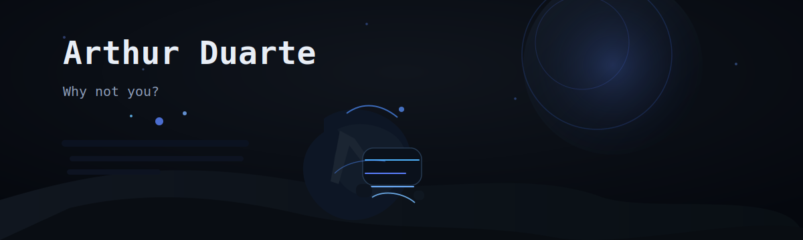
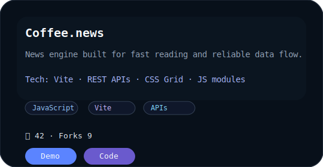
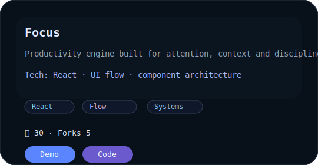
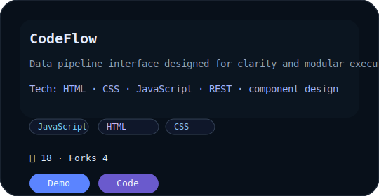

<!--
  Premium GitHub Profile README
  Minimal, dark, elegant, engineering-focused.
-->

  

  

  

## About Me

> 🔹 Software Engineering mindset with a disciplined focus on systems, architecture, and cybersecurity.

I began with web development as a learning laboratory. HTML, CSS and JavaScript were the first tools, but the intent was always to understand underlying systems and engineer reliable solutions.

Today I build projects as structured experiments: real flows, stable architecture, and measurable progress. The goal is not to look polished — it is to become a strong Software Engineer.

## Tech Stack

  
  
  
   
  
  
  
   
  
  
  

## GitHub Dashboard

  

  
  

## Projects

  <table cellspacing="20" cellpadding="0" style="border-collapse: separate; border-spacing: 20px; width: 100%;">
    <tr>
      <td width="33%" valign="top" style="vertical-align: top;">
        
        
Modular news engine built for speed, clear structure and stable data flow.

        
Vite · REST APIs · JavaScript

        
JavaScript · ⭐42 · Forks 9

        <a href="https://github.com/duartexz-dev/coffee.news" style="display:inline-block; margin-right: 8px; padding: 8px 16px; border-radius: 12px; background: #111820; color: #E8EEF6; text-decoration: none; font-family: Consolas, monospace; font-size: 12px;">Repo</a>
        <a href="https://duartexz-dev.github.io/coffee.news" style="display:inline-block; padding: 8px 16px; border-radius: 12px; background: #15203A; color: #A8B5D0; text-decoration: none; font-family: Consolas, monospace; font-size: 12px;">Demo</a>
      </td>
      <td width="33%" valign="top" style="vertical-align: top;">
        
        
A productivity system designed for attention, context and disciplined flow.

        
React · Architecture · UX flow

        
JavaScript · ⭐30 · Forks 5

        <a href="https://github.com/duartexz-dev/focus" style="display:inline-block; margin-right: 8px; padding: 8px 16px; border-radius: 12px; background: #111820; color: #E8EEF6; text-decoration: none; font-family: Consolas, monospace; font-size: 12px;">Repo</a>
        <a href="https://duartexz-dev.github.io/focus" style="display:inline-block; padding: 8px 16px; border-radius: 12px; background: #15203A; color: #A8B5D0; text-decoration: none; font-family: Consolas, monospace; font-size: 12px;">Demo</a>
      </td>
      <td width="33%" valign="top" style="vertical-align: top;">
        
        
A clean interface for data flow, modules and fast decision paths.

        
HTML · CSS · JavaScript · REST

        
JavaScript · ⭐18 · Forks 4

        <a href="https://github.com/duartexz-dev/codeflow" style="display:inline-block; margin-right: 8px; padding: 8px 16px; border-radius: 12px; background: #111820; color: #E8EEF6; text-decoration: none; font-family: Consolas, monospace; font-size: 12px;">Repo</a>
        <a href="https://duartexz-dev.github.io/codeflow" style="display:inline-block; padding: 8px 16px; border-radius: 12px; background: #15203A; color: #A8B5D0; text-decoration: none; font-family: Consolas, monospace; font-size: 12px;">Demo</a>
      </td>
    </tr>
  </table>

  <a href="https://github.com/duartexz-dev?tab=repositories" style="display:inline-block; padding: 14px 30px; border-radius: 18px; background: #111820; color: #E8EEF6; text-decoration: none; font-family: Consolas, monospace; font-size: 13px; letter-spacing: 0.6px;">View all repositories</a>

## Contact

  <a href="https://github.com/duartexz-dev" style="display:inline-flex; align-items:center; gap:8px; text-decoration:none; color:#E8EEF6; font-family:Consolas, monospace; font-size:13px; background:#0D1117; padding:10px 14px; border-radius:14px; border:1px solid #111820;">
    <strong>GitHub</strong>
  </a>
  Discord · arthur#9999

## Footer

Obrigado pela visita 🚀

