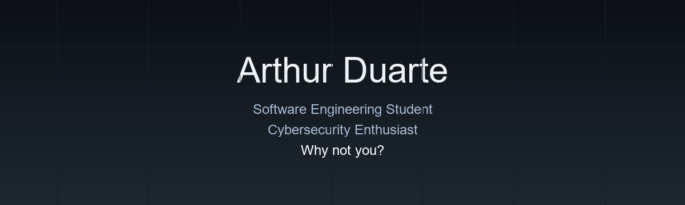
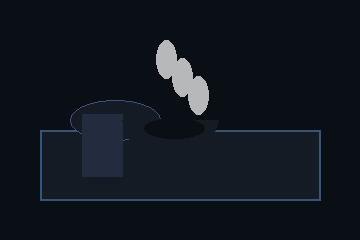

<!--
  Arthur Duarte — GitHub profile
  Dark, minimalist, professional.
-->

<div align="center">
  
</div>

<div align="center" style="margin: 32px 0 24px;">
  
</div>

<div align="center" style="margin-bottom: 40px;">
  
</div>

## Hero Section

> Software Engineering student with a disciplined approach to building meaningful software and learning Cybersecurity in parallel.

## Mission Control

```text
+-----------------------------------------------------------+
|                       MISSION CONTROL                     |
|-----------------------------------------------------------|
| Name              : Arthur Duarte                        |
| Status            : Building strong software systems      |
| Mission           : Become a Software Engineer            |
| Current Focus     : JavaScript · Python · React · REST APIs |
| Programming Since : June 2025                             |
| Coffee Level      : Steady, focused, engineering fuel     |
| Current Project   : Coffee.news                           |
+-----------------------------------------------------------+
```

## About Me

I started programming in June 2025 and I learn by building projects that matter. I enjoy understanding software at a system level and I approach each task as an opportunity to improve engineering judgment. My goal is to become a Software Engineer, with a strong interest in Cybersecurity and real-world applications.

## Engineering Mindset

- Build before consuming.
- Think in systems, not isolated features.
- Quality over quantity.
- Never stop learning.
- Architecture matters at every step.
- Solve real problems with clear, reliable solutions.

## Current Mission

**Mission**  
Become a Software Engineer.

**Current Focus**  
JavaScript · Python · React · REST APIs · Software Engineering · Cybersecurity · AI

## Tech Stack

### Languages  
  
  


### Frameworks  
  
  


### Tools  
  
  


### Learning  
  
  


### Future  
  
  


## GitHub Analytics

<div align="center">
  
</div>

<div align="center" style="margin-top: 16px;">
  
</div>

<div align="center" style="margin-top: 16px; display: grid; gap: 16px; max-width: 920px;">
  
  
  
  
</div>

## Projects

### Coffee.news

Modular news engine built for speed, clear structure, and stable data flow.  
**Stack:** Vite · REST APIs · JavaScript  
[Repo](https://github.com/duartexz-dev/coffee.news) · [Demo](https://duartexz-dev.github.io/coffee.news)

### Focus

A productivity system designed for attention, context, and disciplined flow.  
**Stack:** React · Architecture · UX flow  
[Repo](https://github.com/duartexz-dev/focus) · [Demo](https://duartexz-dev.github.io/focus)

### CodeFlow

A clean interface for data flow, modules and fast decision paths.  
**Stack:** HTML · CSS · JavaScript · REST  
[Repo](https://github.com/duartexz-dev/codeflow) · [Demo](https://duartexz-dev.github.io/codeflow)

<div align="center" style="margin-top: 24px;">
  <a href="https://github.com/duartexz-dev?tab=repositories" style="display:inline-block; padding: 14px 30px; border-radius: 18px; background: #111820; color: #E8EEF6; text-decoration: none; font-family: Consolas, monospace; font-size: 13px; letter-spacing: 0.6px;">View all repositories</a>
</div>

## Contact

<div align="center" style="display: inline-flex; gap: 12px; flex-wrap: wrap; justify-content: center; margin-top: 16px;">
  <a href="https://github.com/duartexz-dev" style="display:inline-flex; align-items:center; gap:8px; text-decoration:none; color:#E8EEF6; font-family:Consolas, monospace; font-size:13px; background:#0D1117; padding:10px 14px; border-radius:14px; border:1px solid #111820;">GitHub</a>
  <span style="display:inline-flex; align-items:center; gap:8px; color:#8C9DB8; font-family:Consolas, monospace; font-size:13px; background:#0D1117; padding:10px 14px; border-radius:14px; border:1px solid #111820;">Discord · arthur#9999</span>
</div>

## Footer

<div align="center" style="color:#8C9DB8; font-family:Consolas, monospace; font-size:13px; margin-top: 28px;">Why not you? · Obrigado pela visita 🚀</div>
