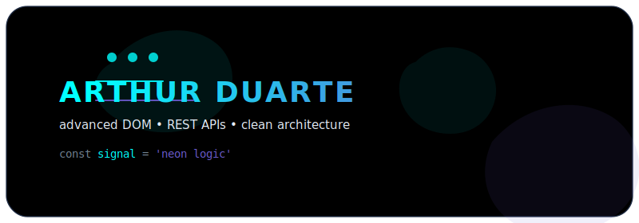
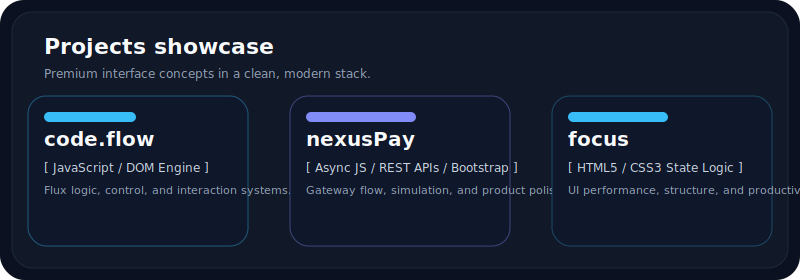
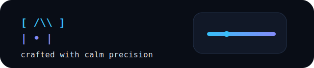

# Arthur Duarte

## About me
I am Arthur Duarte, a web developer focused on building modern, polished experiences with strong attention to structure, performance, and clean interaction systems. I am constantly evolving toward a full-stack path, combining front-end craftsmanship with logic, maintainability, and scalable product thinking.

## Core stack

### Dominados
- JavaScript (ES6+, DOM, Async)
- HTML5
- CSS3
- Bootstrap
- REST APIs

### Em aprimoramento
- Python (automação, lógica e soluções práticas)

## Showcase de projetos

## Teledados do perfil

  <table>
    <tr>
      <td align="center">
        
      </td>
      <td align="center">
        
      </td>
    </tr>
    <tr>
      <td align="center">
        
      </td>
      <td align="center">
        
      </td>
    </tr>
  </table>

## Mapa de contribuição

> Consistency beats talent when talent doesn’t stay consistent. ⭐ If you liked my work, consider leaving a star.

  

