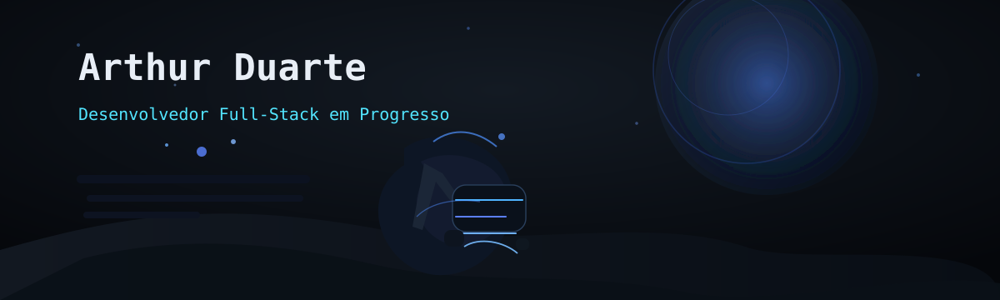

<p align="center">
  
</p>

<p align="center">
  
</p>

<p align="center">
  <a href="https://github.com/duartexz-dev">
    
  </a>
  <a href="https://github.com/duartexz-dev">
    
  </a>
  <a href="https://github.com/duartexz-dev">
    
  </a>
  <a href="https://github.com/duartexz-dev">
    
  </a>
</p>

---

### 👋 Oi, eu sou Arthur Duarte!

```javascript
const dev = {
  nome: "Arthur Duarte",
  user: "duartexz-dev",
  pronouns: "ele/ele",
  role: "Desenvolvedor Full-Stack em Progresso",
  inicio: "Junho de 2025",
  focoAtual: ["JavaScript", "React", "Python", "APIs", "Engenharia de Software"],
  filosofia: "Cada projeto é um passo mais perto de me tornar o desenvolvedor que eu quero ser."
};
```

> **Desenvolvedor Full-Stack em Progresso** — Construindo projetos web com **HTML, CSS e JavaScript** desde **junho de 2025**. Focado em prática consistente, de verdade.

Sou um desenvolvedor apaixonado por tecnologia e desenvolvimento de software.  
Atualmente foco em **JavaScript, React, Python, APIs e Engenharia de Software**, criando projetos reais para aprimorar minhas habilidades e criar aplicações modernas.

Gosto de aprender novas tecnologias, resolver problemas e transformar ideias em aplicações funcionais.

---

## 🌐 Onde me encontrar

<p align="left">
  <a href="https://github.com/duartexz-dev" target="_blank">
    
  </a>
  <a href="https://linkedin.com/in/duartexz-dev" target="_blank">
    
  </a>
  <a href="mailto:contato.arthurduarte@email.com" target="_blank">
    
  </a>
</p>

---

## 🧠 O que eu faço

<table width="100%">
  <tr>
    <td width="50%" valign="top">
      <ul>
        <li>💻 <b>Desenvolvimento Front-End</b> com layouts responsivos</li>
        <li>⚡ <b>Aplicações JavaScript</b> funcionais e dinâmicas</li>
        <li>⚛️ <b>Interfaces React</b> modernas e modulares</li>
        <li>🌐 <b>Integração com REST APIs</b> e manipulação de dados JSON</li>
      </ul>
    </td>
    <td width="50%" valign="top">
      <ul>
        <li>🎨 <b>Design Web Responsivo</b> e otimizado</li>
        <li>🧩 <b>Organização de Código Limpo</b> e boas práticas</li>
        <li>🚀 <b>Construindo projetos pessoais reais</b> diariamente</li>
        <li>📚 <b>Estudando Engenharia de Software</b> continuamente</li>
      </ul>
    </td>
  </tr>
</table>

---

## 🛠️ Stack Tecnológico

### 🎨 Frontend
<p align="left">
  
  
  
  
  
</p>

### ⚙️ Backend & APIs
<p align="left">
  
  
  
  
</p>

### 🔧 Ferramentas & Ecossistema
<p align="left">
  
  
  
  
</p>

---

## 🚀 Projetos em Destaque

<table width="100%">
  <tr>
    <td width="50%" valign="top">
      <h3>📚 <a href="https://github.com/duartexz-dev/CodeFlow">CodeFlow</a></h3>
      <p>Plataforma de ensino de programação desenvolvida <b>100% com Inteligência Artificial</b> usando AntiGravity e suas AIs integradas.</p>
      <p><code>HTML5</code> · <code>CSS3</code> · <code>JavaScript</code> · <code>AI Powered</code></p>
    </td>
    <td width="50%" valign="top">
      <h3>💰 <a href="https://github.com/duartexz-dev/NexusPay">NexusPay</a></h3>
      <p>Plataforma web de simulação de investimentos em renda fixa criada para praticar JavaScript, lógica financeira e front-end.</p>
      <p><code>HTML5</code> · <code>CSS3</code> · <code>JavaScript</code> · <code>Finanças</code></p>
    </td>
  </tr>
  <tr>
    <td width="50%" valign="top">
      <h3>🎯 <a href="https://github.com/duartexz-dev/Focus">Focus</a></h3>
      <p>Plataforma de produtividade desenvolvida com HTML, CSS, JavaScript e Bootstrap para organizar tarefas e acompanhar progresso de forma simples.</p>
      <p><code>HTML5</code> · <code>CSS3</code> · <code>JavaScript</code> · <code>Bootstrap</code></p>
    </td>
    <td width="50%" valign="top">
      <h3>☕ <a href="https://github.com/duartexz-dev">Coffee.news</a></h3>
      <p>Plataforma dinâmica de notícias agregadas utilizando consumo de APIs externas e manipulação de estado.</p>
      <p><code>JavaScript</code> · <code>REST API</code> · <code>JSON</code></p>
    </td>
  </tr>
  <tr>
    <td width="50%" valign="top">
      <h3>📋 <a href="https://github.com/duartexz-dev">DevTask</a></h3>
      <p>Aplicação moderna para organização, categorização e acompanhamento de tarefas diárias de desenvolvedores.</p>
      <p><code>JavaScript</code> · <code>Local Storage</code> · <code>UI Responsiva</code></p>
    </td>
    <td width="50%" valign="top">
      <h3>👨‍💻 <a href="https://github.com/duartexz-dev">Perfil-Stacks</a></h3>
      <p>Projeto de portfólio de desenvolvedores para exibir stacks tecnológicas e repositórios de forma interativa.</p>
      <p><code>React</code> · <code>JavaScript</code> · <code>CSS Modules</code></p>
    </td>
  </tr>
</table>

---

## 📊 Estatísticas do GitHub

<p align="center">
  
  
</p>

<p align="center">
  
</p>

<p align="center">
  
</p>

<p align="center">
  
</p>

---

## 📚 Atualmente Aprendendo

<p align="left">
  
  
  
  
  <br/>
  
  
  
  
</p>

---

## 🎯 Objetivos

- 🚀 **Torne-se um Engenheiro de Software** completo e preparado para desafios de grande porte.
- 🌎 **Construir aplicações úteis** que resolvam problemas reais das pessoas.
- 📈 **Melhorar minhas habilidades de programação todos os dias** com prática consistente.
- 🏗️ **Criar projetos escaláveis**, limpos e bem documentados.
- 🤝 **Contribuir ativamente com a comunidade de desenvolvedores**.

---

## 💻 Minha Jornada de Programação

```
  Jun/2025                  Fim de 2025                Presente & Futuro
     │                           │                             │
     ├── Início da Jornada       ├── Projetos Práticos         ├── Transição Full-Stack
     │   • HTML5 & CSS3          │   • APIs & REST             │   • React.js & Node.js
     │   • JavaScript Fundamentos│   • Bootstrap & Flexbox     │   • Python & Engenharia
     │   • Primeiros projetos    │   • Focus, NexusPay, etc    │   • Projetos Escaláveis
```

---

## 🚀 Filosofia

<p align="center">
  <i>"Cada projeto é um passo mais perto de me tornar o desenvolvedor que eu quero ser."</i>
</p>

---

<p align="center">
  ⭐ <b>Explore meus repositórios e acompanhe minha jornada construindo projetos com código!</b>
</p>

<p align="center">
  
</p>
