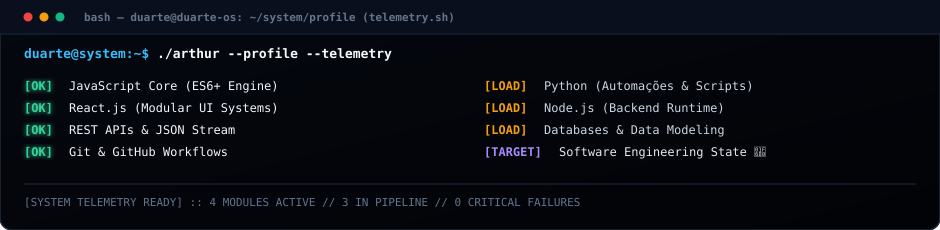
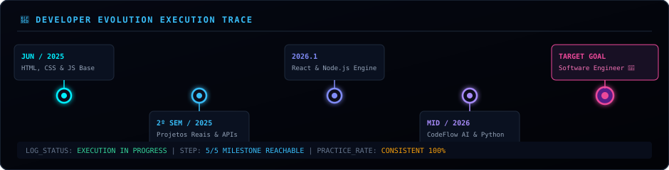
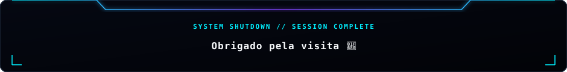

<!-- ========================================================================= -->
<!--                    ARTHUR DUARTE // DEVELOPER SYSTEM                      -->
<!-- ========================================================================= -->

<p align="center">
  
</p>

<p align="center">
  
</p>

<p align="center">
  <a href="https://github.com/duartexz-dev">
    
  </a>
  <a href="https://github.com/duartexz-dev">
    
  </a>
  <a href="https://github.com/duartexz-dev">
    
  </a>
  <a href="https://github.com/duartexz-dev">
    
  </a>
</p>

<p align="center">
  
</p>

<!-- ========================================================================= -->
<!--                         SYSTEM CLI TELEMETRY                              -->
<!-- ========================================================================= -->

## ⚡ SYSTEM TELEMETRY // CLI MATRIX

<p align="center">
  
</p>

```bash
╔═════════════════════════════════════════════════════════════════════════════════════╗
║                   🌐 DUARTE.DEV // SYSTEM TELEMETRY MONITOR                         ║
╠═════════════════════════════════════════════════════════════════════════════════════╣
║  • OPERATOR .......... Arthur Duarte (@duartexz-dev)                                ║
║  • SYSTEM KERNEL ..... DUARTE_OS v3.5 [ ONLINE // 0 CRITICAL FAILURES ]             ║
║  • ESTABLISHED ....... Junho de 2025 (Construção contínua através de projetos)       ║
║  • PRIMARY IDENTITY .. Software Engineering Student / Developer                     ║
║  • ACTIVE CORE ....... JavaScript (ES6+), React.js, REST APIs, Git & GitHub        ║
║  • PIPELINE QUEUE .... Python, Node.js Engine, Databases, Systems Architecture       ║
╚═════════════════════════════════════════════════════════════════════════════════════╝
```

<p align="center">
  
</p>

<!-- ========================================================================= -->
<!--                                ABOUT ME                                   -->
<!-- ========================================================================= -->

## 👤 ABOUT // SYSTEM PROFILE

```typescript
import { SoftwareEngineeringStudent, DeveloperSystem } from '@duarte/core';

export class ArthurDuarte implements SoftwareEngineeringStudent {
  public readonly name: string = "Arthur Duarte";
  public readonly username: string = "duartexz-dev";
  public readonly pronouns: string = "ele/ele";
  public readonly location: string = "Brasil 🇧🇷";
  public readonly startedLearning: string = "Junho de 2025";
  public readonly targetRole: string = "Software Engineer";

  public readonly interests: string[] = [
    "Software Engineering",
    "Cybersecurity",
    "Systems Architecture",
    "Backend & APIs",
    "Automation"
  ];

  public getPhilosophy(): string {
    return "Cada projeto é um passo mais perto de me tornar o desenvolvedor que eu quero ser.";
  }
}
```

### 🎯 Visão Geral
Sou um desenvolvedor focado em evoluir continuamente para me tornar um **Software Engineer**. Minha trajetória começou em **junho de 2025**, pautada pela prática constante, construção de projetos reais e estudo aprofundado dos fundamentos de tecnologia.

Gosto de resolver problemas técnicos, criar aplicações funcionais do zero, explorar consumo e integração de APIs, entender a fundo o funcionamento de sistemas e organizar códigos limpos e estruturados.

- 🧪 **Laboratório Atual:** Desenvolvimento com JavaScript, React, automações em Python, estudos de Node.js, modelagem de bancos de dados e Engenharia de Software.
- 🛡️ **Áreas de Interesse Técnico:** Engenharia de Software, Cybersecurity, Automação, Sistemas e Arquitetura de Aplicações.

<p align="center">
  
</p>

<!-- ========================================================================= -->
<!--                               TECH STACK                                  -->
<!-- ========================================================================= -->

## 🛠️ TECH STACK ARCHITECTURE

<table width="100%">
  <tr>
    <td width="50%" valign="top">
      <h3>💻 CORE & INTERFACE <sub style="color:#34D399;">[ UTILIZO / ATIVO ]</sub></h3>
      <p>
        
        
        
        <br/>
        
        
      </p>
    </td>
    <td width="50%" valign="top">
      <h3>⚙️ BACKEND & APIs <sub style="color:#A78BFA;">[ ESTUDANDO / EM PIPELINE ]</sub></h3>
      <p>
        
        
        <br/>
        
        
      </p>
    </td>
  </tr>
  <tr>
    <td width="50%" valign="top">
      <h3>🔧 ENVIRONMENT & TOOLS <sub style="color:#34D399;">[ UTILIZO ]</sub></h3>
      <p>
        
        
        <br/>
        
        
      </p>
    </td>
    <td width="50%" valign="top">
      <h3>🏗️ ENGINEERING & LOGIC <sub style="color:#A78BFA;">[ ESTUDANDO ]</sub></h3>
      <p>
        
        
        <br/>
        
        
      </p>
    </td>
  </tr>
</table>

<p align="center">
  
</p>

<!-- ========================================================================= -->
<!--                              PROJECT ARCHIVE                              -->
<!-- ========================================================================= -->

## 🗄️ PROJECT ARCHIVE // DATABASE

<table width="100%">
  <tr>
    <td width="50%" valign="top">
      <h4><code>MODULE_01</code> 📚 <a href="https://github.com/duartexz-dev/CodeFlow">CodeFlow</a></h4>
      <p><b>[ AI POWERED LAB ]</b></p>
      <p>Plataforma de ensino de programação desenvolvida <b>100% com Inteligência Artificial</b> utilizando AntiGravity e suas AIs integradas.</p>
      <p><code>HTML5</code> · <code>CSS3</code> · <code>JavaScript</code> · <code>AntiGravity AI</code></p>
      <p><a href="https://github.com/duartexz-dev/CodeFlow"><b>[ VIEW REPOSITORY ]</b></a></p>
    </td>
    <td width="50%" valign="top">
      <h4><code>MODULE_02</code> 💰 <a href="https://github.com/duartexz-dev/NexusPay">NexusPay</a></h4>
      <p><b>[ FINTECH SIMULATOR ]</b></p>
      <p>Plataforma web de simulação de investimentos em renda fixa criada para praticar lógica financeira, cálculos assíncronos e front-end.</p>
      <p><code>HTML5</code> · <code>CSS3</code> · <code>JavaScript</code> · <code>Finanças</code></p>
      <p><a href="https://github.com/duartexz-dev/NexusPay"><b>[ VIEW REPOSITORY ]</b></a></p>
    </td>
  </tr>
  <tr>
    <td width="50%" valign="top">
      <h4><code>MODULE_03</code> 🎯 <a href="https://github.com/duartexz-dev/Focus">Focus</a></h4>
      <p><b>[ PRODUCTIVITY SYSTEM ]</b></p>
      <p>Plataforma de produtividade construída com HTML, CSS, JS e Bootstrap para gerenciamento de tarefas e acompanhamento de progresso.</p>
      <p><code>HTML5</code> · <code>CSS3</code> · <code>JavaScript</code> · <code>Bootstrap</code></p>
      <p><a href="https://github.com/duartexz-dev/Focus"><b>[ VIEW REPOSITORY ]</b></a></p>
    </td>
    <td width="50%" valign="top">
      <h4><code>MODULE_04</code> ☕ <a href="https://github.com/duartexz-dev">Coffee.news</a></h4>
      <p><b>[ API AGGREGATOR ] ☕</b></p>
      <p>Plataforma dinâmica de notícias agregadas consumindo APIs REST externas e estruturando feeds em tempo real.</p>
      <p><code>JavaScript</code> · <code>REST API</code> · <code>JSON</code> · <code>Coffee Stream</code></p>
      <p><a href="https://github.com/duartexz-dev"><b>[ VIEW REPOSITORY ]</b></a></p>
    </td>
  </tr>
  <tr>
    <td width="50%" valign="top">
      <h4><code>MODULE_05</code> 📋 <a href="https://github.com/duartexz-dev">DevTask</a></h4>
      <p><b>[ WORKFLOW MANAGER ]</b></p>
      <p>Aplicação voltada para organização, categorização e acompanhamento de tarefas diárias do fluxo de desenvolvimento.</p>
      <p><code>JavaScript</code> · <code>Local Storage</code> · <code>UI Responsiva</code></p>
      <p><a href="https://github.com/duartexz-dev"><b>[ VIEW REPOSITORY ]</b></a></p>
    </td>
    <td width="50%" valign="top">
      <h4><code>MODULE_06</code> 👨‍💻 <a href="https://github.com/duartexz-dev">Perfil-Stacks</a></h4>
      <p><b>[ REACT PORTFOLIO ]</b></p>
      <p>Projeto de portfólio interativo de desenvolvedores para exibição de stacks tecnológicas e repositórios principais.</p>
      <p><code>React</code> · <code>JavaScript</code> · <code>CSS Modules</code></p>
      <p><a href="https://github.com/duartexz-dev"><b>[ VIEW REPOSITORY ]</b></a></p>
    </td>
  </tr>
</table>

<p align="center">
  <br/>
  <a href="https://github.com/duartexz-dev?tab=repositories">
    
  </a>
</p>

<p align="center">
  
</p>

<!-- ========================================================================= -->
<!--                            SYSTEM ANALYTICS                               -->
<!-- ========================================================================= -->

## 📊 SYSTEM ANALYTICS & METRICS

<p align="center">
  
  
</p>

<p align="center">
  <a href="https://github.com/duartexz-dev">
    
  </a>
  <a href="https://github.com/duartexz-dev">
    
  </a>
</p>

<p align="center">
  <a href="https://github.com/duartexz-dev">
    
  </a>
</p>

<p align="center">
  <a href="https://github.com/duartexz-dev">
    
  </a>
</p>

<p align="center">
  <a href="https://github.com/duartexz-dev">
    
  </a>
</p>

<p align="center">
  <a href="https://github.com/duartexz-dev">
    
  </a>
</p>

<p align="center">
  
</p>

<!-- ========================================================================= -->
<!--                            DEVELOPER JOURNEY                              -->
<!-- ========================================================================= -->

## 🧭 DEVELOPER EVOLUTION JOURNEY

<p align="center">
  
</p>

```
EXECUTION TRACE :: EVOLUTION_LOG
---------------------------------------------------------------------------------
[2025.06] SYSTEM INITIALIZED ──> Fundamentos de HTML5, CSS3 & JavaScript Core
[2025.2]  REAL PROJECTS ───────> Focus, NexusPay, Coffee.news, DevTask & APIs
[2026.1]  FRONTEND EXPANSION ──> Componentização com React.js & Node.js Engine
[MID/26]  AI LAB ──────────────> CodeFlow (desenvolvido 100% com AntiGravity AI)
[FUTURE]  SOFTWARE ENGINEER ───> Python, Banco de Dados & Arquitetura de Sistemas
---------------------------------------------------------------------------------
```

<p align="center">
  
</p>

<!-- ========================================================================= -->
<!--                       BUILD PIPELINE & QUEUE                              -->
<!-- ========================================================================= -->

## 📚 BUILD PIPELINE // CURRENTLY LEARNING

<table width="100%">
  <tr>
    <td width="33%" valign="top">
      <h4><code>[ACTIVE]</code> ⚛️ React.js</h4>
      <p>Construção de interfaces modulares, manipulação de estado e hooks avançados.</p>
    </td>
    <td width="33%" valign="top">
      <h4><code>[LEARNING]</code> 🐍 Python</h4>
      <p>Automações de tarefas, scripts de dados e lógica backend.</p>
    </td>
    <td width="33%" valign="top">
      <h4><code>[ACTIVE]</code> 🌐 REST APIs</h4>
      <p>Consumo, tratamento de respostas e integração de requisições assíncronas.</p>
    </td>
  </tr>
  <tr>
    <td width="33%" valign="top">
      <h4><code>[LEARNING]</code> 📦 Node.js</h4>
      <p>Entendimento de ambiente de execução backend e servidor em JavaScript.</p>
    </td>
    <td width="33%" valign="top">
      <h4><code>[LEARNING]</code> 🗄️ Databases</h4>
      <p>Modelagem de dados, queries relacionais e armazenamento não-relacional.</p>
    </td>
    <td width="33%" valign="top">
      <h4><code>[LEARNING]</code> 🏗️ Software Eng.</h4>
      <p>Padrões de projeto, Clean Code, testes e arquitetura escalável.</p>
    </td>
  </tr>
</table>

<p align="center">
  
</p>

<!-- ========================================================================= -->
<!--                            CYBERSECURITY & INTERESTS                      -->
<!-- ========================================================================= -->

## 🛡️ INTEREST AREAS // FUTURISTIC VECTOR

- 🏗️ **Software Engineering**: Arquitetura de sistemas, algoritmos e boas práticas de engenharia.
- 🛡️ **Cybersecurity**: Segurança da informação, análise de vulnerabilidades e defesa de sistemas.
- ⚙️ **Systems & Automation**: Scripts de automação de tarefas e utilitários de sistema.
- 🌐 **APIs & Backend Data**: Criação de fluxos de dados resilientes e comunicação de rede.

<p align="center">
  
</p>

<!-- ========================================================================= -->
<!--                              PHILOSOPHY                                   -->
<!-- ========================================================================= -->

## 💬 SYSTEM PHILOSOPHY

> **`"Cada projeto é um passo mais perto de me tornar o desenvolvedor que eu quero ser."`**

<p align="center">
  
</p>

<!-- ========================================================================= -->
<!--                                CONNECT                                    -->
<!-- ========================================================================= -->

## 🔗 CONNECT // DIRECT CHANNELS

<p align="center">
  <a href="https://github.com/duartexz-dev" target="_blank">
    
  </a>
  &nbsp;
  <a href="https://linkedin.com/in/duartexz-dev" target="_blank">
    
  </a>
  &nbsp;
  <a href="mailto:contato.arthurduarte@email.com" target="_blank">
    
  </a>
</p>

<p align="center">
  <br/>
  
</p>
