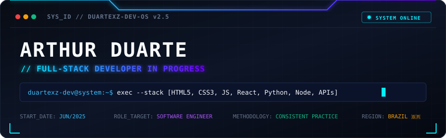
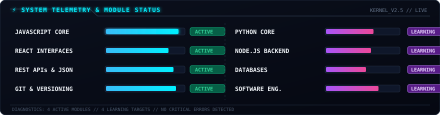
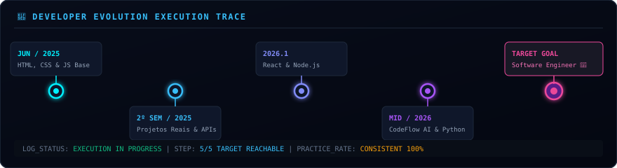

<!-- ========================================================================= -->
<!--                      ARTHUR DUARTE — DEVELOPER SYSTEM                      -->
<!-- ========================================================================= -->

<p align="center">
  
</p>

<p align="center">
  <a href="https://github.com/duartexz-dev">
    
  </a>
  <a href="https://github.com/duartexz-dev">
    
  </a>
  <a href="https://github.com/duartexz-dev">
    
  </a>
  <a href="https://github.com/duartexz-dev">
    
  </a>
</p>

<p align="center">
  
</p>

<!-- ========================================================================= -->
<!--                             SYSTEM STATUS                                 -->
<!-- ========================================================================= -->

## ⚡ SYSTEM STATUS & TELEMETRY

<p align="center">
  
</p>

```
SYSTEM METRICS LOG
---------------------------------------------------------------------------------
[CORE KERNEL] ...... ONLINE (100%)    | [BOOTSTRAP DATE] .. JUN 2025
[JAVASCRIPT] ....... ACTIVE (90%)     | [PRIMARY FOCUS] ... FRONTEND & REACT
[REST APIs] ........ ACTIVE (85%)     | [TARGET ROLE] ..... SOFTWARE ENGINEER
[PYTHON / BACKEND] . LEARNING (55%)   | [STATUS] .......... 0 ERRORS // CONTINUOUS
---------------------------------------------------------------------------------
```

<p align="center">
  
</p>

<!-- ========================================================================= -->
<!--                                ABOUT ME                                   -->
<!-- ========================================================================= -->

## 👤 DEVELOPER PROFILE // WHO AM I?

```typescript
interface DeveloperSystem {
  name: string;
  alias: string;
  pronouns: string;
  established: string; // "Junho de 2025"
  coreRole: string; // "Desenvolvedor Full-Stack em Progresso"
  mission: string;
}

const duartexz: DeveloperSystem = {
  name: "Arthur Duarte",
  alias: "duartexz-dev",
  pronouns: "ele/ele",
  established: "Junho de 2025",
  coreRole: "Desenvolvedor Full-Stack em Progresso",
  mission: "Construir aplicações modernas, resolver problemas reais e evoluir diariamente rumo à Engenharia de Software."
};
```

**Arthur Duarte** — Desenvolvedor Full-Stack em Progresso.  
Estudo e construo software ativamente desde **junho de 2025**. Meu trabalho é pautado na prática consistente, criando aplicações funcionais, experimentando APIs, aplicando boas práticas de código limpo e explorando novas arquiteturas de software.

- ⚙️ **Foco de Trabalho:** Desenvolvimento Web Responsivo, Interfaces React, Aplicações JavaScript e Integrações de APIs.
- 🧪 **Laboratório de Aprendizado:** Construção de aplicações reais, automações com Python, estudos de Node.js, Banco de Dados e Engenharia de Software.

<p align="center">
  
</p>

<!-- ========================================================================= -->
<!--                               TECH STACK                                  -->
<!-- ========================================================================= -->

## 🛠️ TECH STACK ARCHITECTURE

<table width="100%">
  <tr>
    <td width="50%" valign="top">
      <h3>💻 FRONTEND ENGINE <sub style="color:#34D399;">[ UTILIZO ]</sub></h3>
      <p>
        
        
        
        <br/>
        
        
      </p>
    </td>
    <td width="50%" valign="top">
      <h3>⚙️ BACKEND & APIs <sub style="color:#C084FC;">[ ESTUDANDO / EXPANDINDO ]</sub></h3>
      <p>
        
        
        <br/>
        
        
      </p>
    </td>
  </tr>
  <tr>
    <td width="50%" valign="top">
      <h3>🔧 DEVELOPER TOOLS <sub style="color:#34D399;">[ UTILIZO ]</sub></h3>
      <p>
        
        
        <br/>
        
        
      </p>
    </td>
    <td width="50%" valign="top">
      <h3>🏗️ ENGINEERING CONCEPTS <sub style="color:#C084FC;">[ EM APRENDIZADO ]</sub></h3>
      <p>
        
        
        <br/>
        
        
      </p>
    </td>
  </tr>
</table>

<p align="center">
  
</p>

<!-- ========================================================================= -->
<!--                              PROJECT ARCHIVE                              -->
<!-- ========================================================================= -->

## 🗄️ PROJECT ARCHIVE // DATABASE

<table width="100%">
  <tr>
    <td width="50%" valign="top">
      <h4><code>DB_REF: 01</code> 📚 <a href="https://github.com/duartexz-dev/CodeFlow">CodeFlow</a></h4>
      <p><b>[ AI LAB / EXPERIMENTAL ]</b></p>
      <p>Plataforma de ensino de programação desenvolvida <b>100% com Inteligência Artificial</b> utilizando AntiGravity e suas AIs integradas.</p>
      <p><code>HTML5</code> · <code>CSS3</code> · <code>JavaScript</code> · <code>AntiGravity AI</code></p>
    </td>
    <td width="50%" valign="top">
      <h4><code>DB_REF: 02</code> 💰 <a href="https://github.com/duartexz-dev/NexusPay">NexusPay</a></h4>
      <p><b>[ FINTECH / SIMULATOR ]</b></p>
      <p>Plataforma web de simulação de investimentos em renda fixa desenvolvida para praticar lógica financeira, cálculos assíncronos e front-end.</p>
      <p><code>HTML5</code> · <code>CSS3</code> · <code>JavaScript</code> · <code>Finanças</code></p>
    </td>
  </tr>
  <tr>
    <td width="50%" valign="top">
      <h4><code>DB_REF: 03</code> 🎯 <a href="https://github.com/duartexz-dev/Focus">Focus</a></h4>
      <p><b>[ PRODUCTIVITY / APP ]</b></p>
      <p>Plataforma de produtividade completa para organização de tarefas e acompanhamento de progresso de forma simples e moderna.</p>
      <p><code>HTML5</code> · <code>CSS3</code> · <code>JavaScript</code> · <code>Bootstrap</code></p>
    </td>
    <td width="50%" valign="top">
      <h4><code>DB_REF: 04</code> ☕ <a href="https://github.com/duartexz-dev">Coffee.news</a></h4>
      <p><b>[ API INTEGRATION / NEWS ]</b></p>
      <p>Agregador dinâmico de notícias de tecnologia consumindo APIs REST externas e gerando feeds atualizados.</p>
      <p><code>JavaScript</code> · <code>REST API</code> · <code>JSON</code> · <code>DOM</code></p>
    </td>
  </tr>
  <tr>
    <td width="50%" valign="top">
      <h4><code>DB_REF: 05</code> 📋 <a href="https://github.com/duartexz-dev">DevTask</a></h4>
      <p><b>[ TASK MANAGER / UTILITY ]</b></p>
      <p>Aplicação voltada para organização, gestão de prioridades e fluxo de trabalho diário de desenvolvedores.</p>
      <p><code>JavaScript</code> · <code>Local Storage</code> · <code>UI Responsiva</code></p>
    </td>
    <td width="50%" valign="top">
      <h4><code>DB_REF: 06</code> 👨‍💻 <a href="https://github.com/duartexz-dev">Perfil-Stacks</a></h4>
      <p><b>[ PORTFOLIO / REACT ]</b></p>
      <p>Projeto de portfólio interativo para desenvolvedores exibirem suas stacks tecnológicas e projetos principais.</p>
      <p><code>React</code> · <code>JavaScript</code> · <code>CSS Modules</code></p>
    </td>
  </tr>
</table>

<p align="center">
  
</p>

<!-- ========================================================================= -->
<!--                            GITHUB ANALYTICS                               -->
<!-- ========================================================================= -->

## 📊 GITHUB ANALYTICS & METRICS DASHBOARD

<p align="center">
  
  
</p>

<p align="center">
  
</p>

<p align="center">
  
</p>

<p align="center">
  
</p>

<p align="center">
  
</p>

<!-- ========================================================================= -->
<!--                            DEVELOPER JOURNEY                              -->
<!-- ========================================================================= -->

## 🧭 DEVELOPER EVOLUTION JOURNEY

<p align="center">
  
</p>

```
EXECUTION LOG :: DEVELOPER_EVOLUTION_PATH
---------------------------------------------------------------------------------
[STEP 1] Jun/2025: Início da jornada | Fundamentos de HTML5, CSS3 & JavaScript Core
[STEP 2] 2ºSem/2025: Projetos reais | Manipulação de DOM, REST APIs & Bootstrap
[STEP 3] 2026.1: Expansão Frontend | Componentização com React.js & Node.js
[STEP 4] Mid/2026: Lab de IA & Automação | CodeFlow (AntiGravity AI) & Python
[STEP 5] FUTURE: Engenharia de Software | Arquitetura de Sistemas & Aplicações Escaláveis
---------------------------------------------------------------------------------
```

<p align="center">
  
</p>

<!-- ========================================================================= -->
<!--                           CURRENTLY LEARNING                              -->
<!-- ========================================================================= -->

## 📚 CURRENTLY LEARNING // SYSTEM EXPANSION

<table width="100%">
  <tr>
    <td width="25%">
      <b>⚛️ React.js</b><br/>
      <sub style="color:#94A3B8;">Components, Hooks, State</sub>
    </td>
    <td width="25%">
      <b>🐍 Python</b><br/>
      <sub style="color:#94A3B8;">Scripts &amp; Automação</sub>
    </td>
    <td width="25%">
      <b>🌐 REST APIs</b><br/>
      <sub style="color:#94A3B8;">Consumo &amp; Integrações</sub>
    </td>
    <td width="25%">
      <b>📦 Node.js</b><br/>
      <sub style="color:#94A3B8;">Backend Runtime</sub>
    </td>
  </tr>
  <tr>
    <td width="25%">
      <b>🏗️ Software Eng.</b><br/>
      <sub style="color:#94A3B8;">Padrões &amp; Arquitetura</sub>
    </td>
    <td width="25%">
      <b>🧠 Lógica Core</b><br/>
      <sub style="color:#94A3B8;">Algoritmos &amp; Soluções</sub>
    </td>
    <td width="25%">
      <b>🗄️ Databases</b><br/>
      <sub style="color:#94A3B8;">Modelagem &amp; SQL/NoSQL</sub>
    </td>
    <td width="25%">
      <b>🔧 Git &amp; GitHub</b><br/>
      <sub style="color:#94A3B8;">Versionamento Avançado</sub>
    </td>
  </tr>
</table>

<p align="center">
  
</p>

<!-- ========================================================================= -->
<!--                                 GOALS                                     -->
<!-- ========================================================================= -->

## 🎯 ROADMAP & TARGET MILESTONES

- `[MILESTONE_01]` **Tornar-se Software Engineer**: Formar sólida base em ciência da computação, arquitetura e engenharia.
- `[MILESTONE_02]` **Construir Aplicações Úteis**: Desenvolver soluções reais que agreguem valor aos usuários.
- `[MILESTONE_03]` **Evolução Diária**: Manter disciplina contínua de escrita de código e resolução de problemas.
- `[MILESTONE_04]` **Projetos Escaláveis**: Aplicar boas práticas, testes, modularidade e código limpo.
- `[MILESTONE_05]` **Contribuição Comunitária**: Apoiar e compartilhar conhecimentos com a comunidade de desenvolvedores.

<p align="center">
  
</p>

<!-- ========================================================================= -->
<!--                              PHILOSOPHY                                   -->
<!-- ========================================================================= -->

## 💬 SYSTEM PHILOSOPHY

> **`"Cada projeto é um passo mais perto de me tornar o desenvolvedor que eu quero ser."`**

<p id="contact" align="center">
  
</p>

<!-- ========================================================================= -->
<!--                                CONTACT                                    -->
<!-- ========================================================================= -->

## 🔗 CONNECT // CONTACT CHANNELS

<p align="center">
  <a href="https://github.com/duartexz-dev" target="_blank">
    
  </a>
  &nbsp;
  <a href="https://linkedin.com/in/duartexz-dev" target="_blank">
    
  </a>
  &nbsp;
  <a href="mailto:contato.arthurduarte@email.com" target="_blank">
    
  </a>
</p>

<p align="center">
  <br/>
  
</p>
